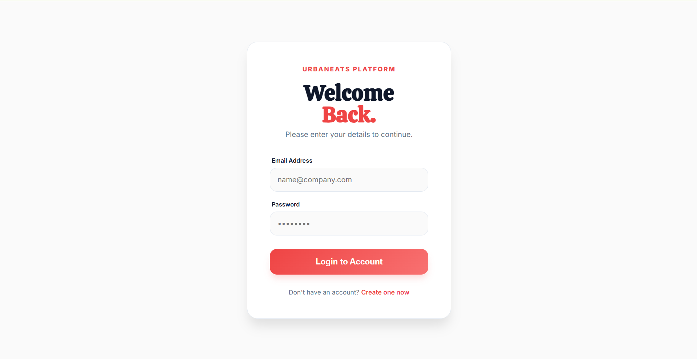
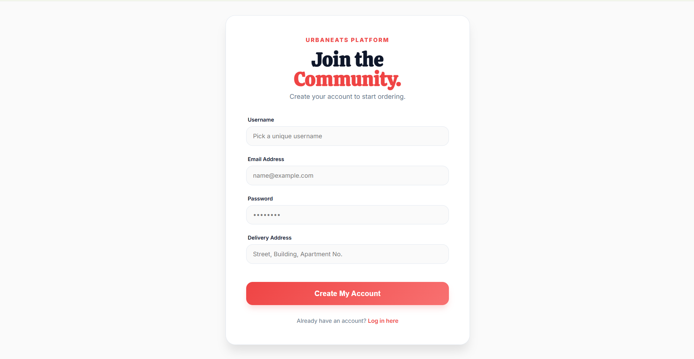
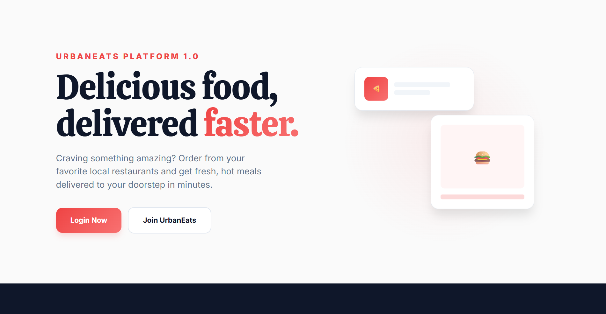
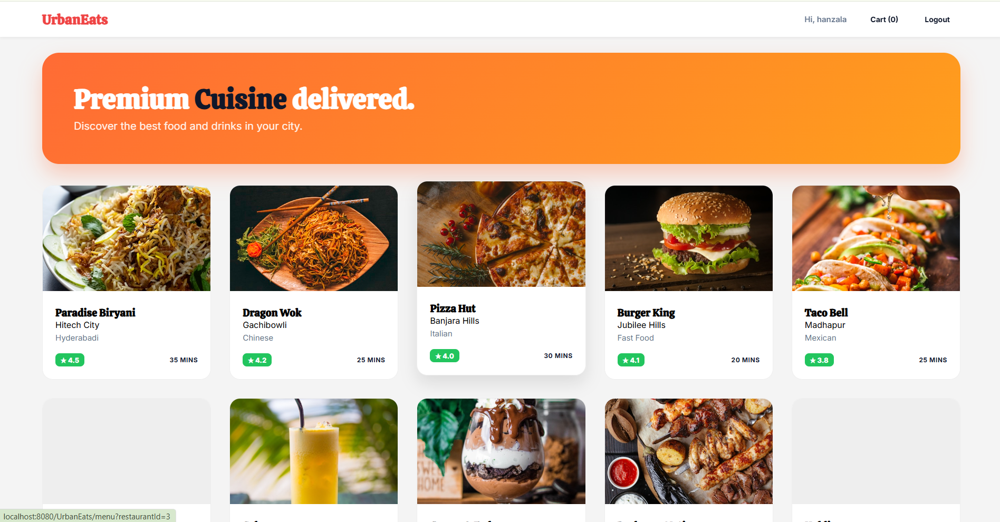
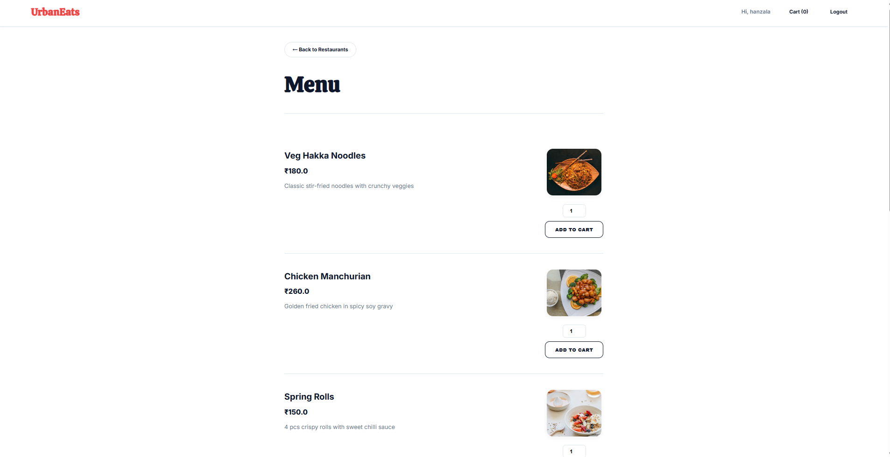
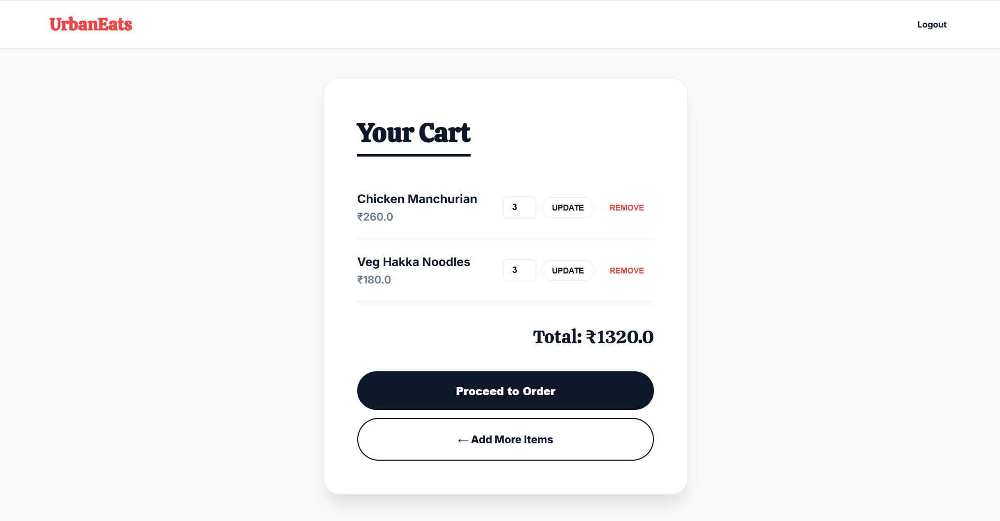
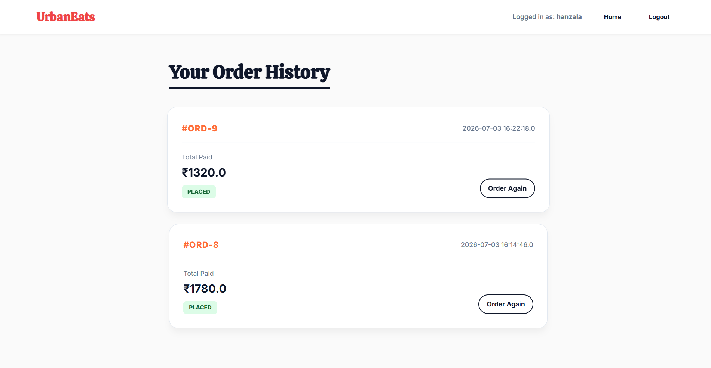

# 🍔 UrbanEats - Online Food Ordering Web Application

UrbanEats is a dynamic web-based food ordering application developed using **Java Servlets, JSP, JDBC, and MySQL**. It allows users to browse restaurant menus, add food items to a shopping cart, and place orders through a simple and user-friendly interface.

The project follows the **MVC (Model-View-Controller)** architecture and demonstrates core Java Enterprise concepts such as Servlets, JSP, Session Management, JDBC, and DAO Design Pattern.

---

## 🚀 Features

- 👤 User Registration & Login
- 🔐 Session-based Authentication
- 🍽️ Browse Restaurants
- 📋 View Restaurant Menus
- 🛒 Add/Update/Remove Items from Cart
- 💰 Dynamic Cart Total Calculation
- 📦 Checkout Process
- 🗃️ Database Connectivity using JDBC
- 🏛️ DAO Layer for Database Operations
- 📱 Clean and Responsive User Interface

---

## 🛠️ Tech Stack

### Backend
- Java
- Java Servlets
- JDBC
- Apache Tomcat 10

### Frontend
- JSP
- HTML5
- CSS3
- JavaScript

### Database
- MySQL

### Development Tools
- Eclipse IDE
- Git & GitHub

---

## 📂 Project Structure

```
UrbanEats/
│
├── src/
│   └── main/
│       ├── java/
│       │   └── com.urbaneats
│       │       ├── controller/
│       │       ├── dao/
│       │       ├── daoimpl/
│       │       ├── model/
│       │       └── util/
│       │
│       ├── lib/
│       │
│       └── webapp/
│           ├── images/
│           ├── META-INF/
│           ├── WEB-INF/
│           ├── index.jsp
│           ├── home.jsp
│           ├── login.jsp
│           ├── menu.jsp
│           └── cart.jsp
│
└── README.md
```

---

## 🏗️ Architecture

```
Client (Browser)
        │
        ▼
     JSP Pages
        │
        ▼
    Java Servlets
        │
        ▼
     DAO Layer
        │
        ▼
 JDBC (MySQL Database)
```

---

## ⚙️ Setup Instructions

### 1. Clone the Repository

```bash
git clone https://github.com/sufyankhan1127/UrbanEats.git
```

### 2. Import into Eclipse

- File → Import
- Existing Projects into Workspace

### 3. Configure Apache Tomcat

- Install Apache Tomcat 10
- Add the server in Eclipse
- Configure the project with Tomcat

### 4. Configure MySQL Database

- Create the required database
- Import the SQL script
- Update the database credentials in:

```
DBConnection.java
```

Example:

```java
String url = "jdbc:mysql://localhost:3306/urbaneats";
String username = "root";
String password = "your_password";
```

### 5. Run the Project

- Right Click Project
- Run As → Run on Server

Open:

```
http://localhost:8080/UrbanEats/
```

---

## 📸 Screenshots


### Login Page


### Register Page



## Login Page


## Register Page


## Home Page



## Restaurant Page



## Menu Page



## Cart Page



## Order History Page


---

## 🎯 Concepts Demonstrated

- MVC Architecture
- Java Servlets
- JSP
- Session Management
- JDBC
- DAO Design Pattern
- Object-Oriented Programming
- CRUD Operations
- Git & GitHub Version Control

---

## 🔮 Future Enhancements

- Admin Dashboard
- Order History
- Payment Gateway Integration
- Email Notifications
- Search & Filter
- Restaurant Ratings & Reviews
- Responsive UI using Bootstrap
- Spring Boot Migration
- REST API Implementation

---

## 👨‍💻 Author

**Mohd Sufyan Khan**

- GitHub: https://github.com/sufyankhan1127
- LinkedIn: https://www.linkedin.com/in/mohd-sufyan-khan-1127sk/

---

## ⭐ If you like this project

Please consider giving it a ⭐ on GitHub.